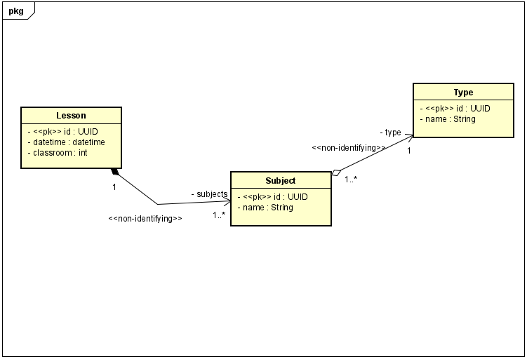

# backend-g2


# Modelagem de dados

 


 

# Lessons Fast-API - Versão 0.95.1


Aplicação utilizando REST API com a linguagem Python, utilizando uma conexão com o Postgres para as operações CRUD realizadas. O framework Fast-API é o mais recente e um dos mais poderosos frameworks Python para a construção de APIs Rest.


# Rotas

## Lessons

| Método HTTP | Endpoint              | Descrição                   |
|-------------|-----------------------|-----------------------------|
| GET         | /lessons/             | Mostra todoas as aulas      |   
| GET         | /lessons/{lesson_id}  | Mostra uma aula específica  |
| POST        | /lessons              | Adiciona uma aula           |
| PUT         | /lessons/{lesson_id}  | Atualiza uma aula           |
| DELETE      | /lessons/{lesson_id}  | Deleta uma aula             |
| PATCH       | /lessons/{lesson_id}  | Corrige uma aula            |


## Subjects - Students

| Método HTTP | Endpoint                | Descrição                   |
|-------------|-------------------------|-----------------------------|
| GET         | /students/              | Mostra todos os alunos      |   
| GET         | /students/{student_id}  | Mostra um aluno específico  |
| POST        | /students/              | Adiciona um aluno           |
| PUT         | /students/{student_id}  | Atualiza um aluno           |
| DELETE      | /students/{student_id}  | Deleta uma aula             |
| PATCH       | /students/{student_id}  | Corrige um aluno            |


## Types

| Método HTTP | Endpoint                     | Descrição                        |
|-------------|------------------------------|----------------------------------|
| GET      | /lessons_type/                  | Mostra todas os tipos de aula    |
| GET      | /lessons_type/{lesson_type_id}  | Mostra um tipo específico de aula|
| POST     | /lessons_type                   | Adiciona um tipo de aula         |
| PUT      | /lessons_type/{lesson_type_id}  | Atualiza um tipo de aula         |
| DELETE   | /lessons_type/{lesson_type_id}  | Deleta um tipo de aula           |
| PATCH    | /lessons_type/{lesson_type_id}  | Corrige um tipo de aula          |


# Instalação

```bash
--recursive -submodules
```


Instalar as dependências do projeto:

```bash
pip install -r requirements.txt
```

Criar e ativar um ambiente virtual:

```bash
python -m venv venv
source venv/bin/activate
```

Rodar o projeto:

```bash
uvicorn main:app --reload
```

AWS:

```
ec2-18-220-210-173.us-east-2.compute.amazonaws.com:8000/docs
```
